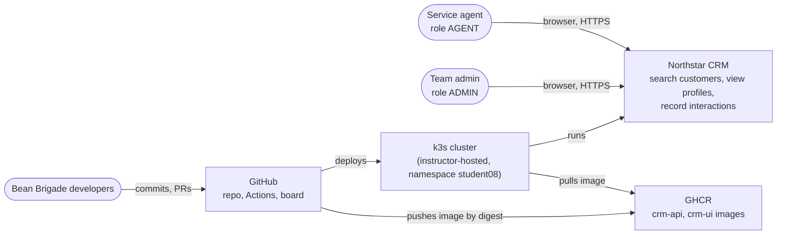
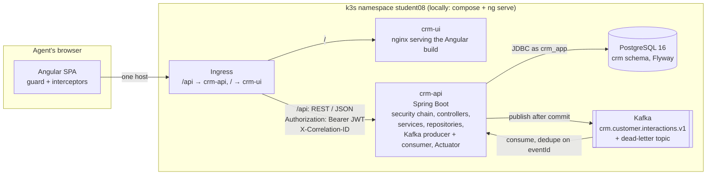
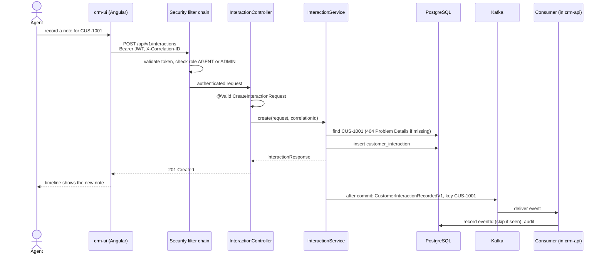
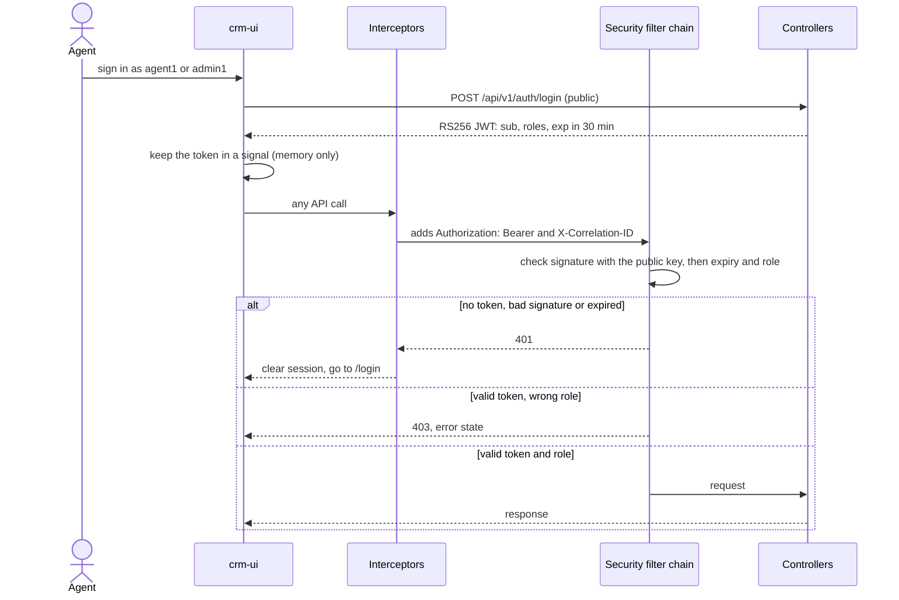
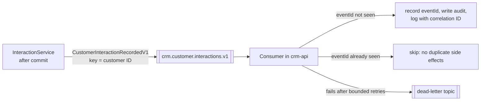
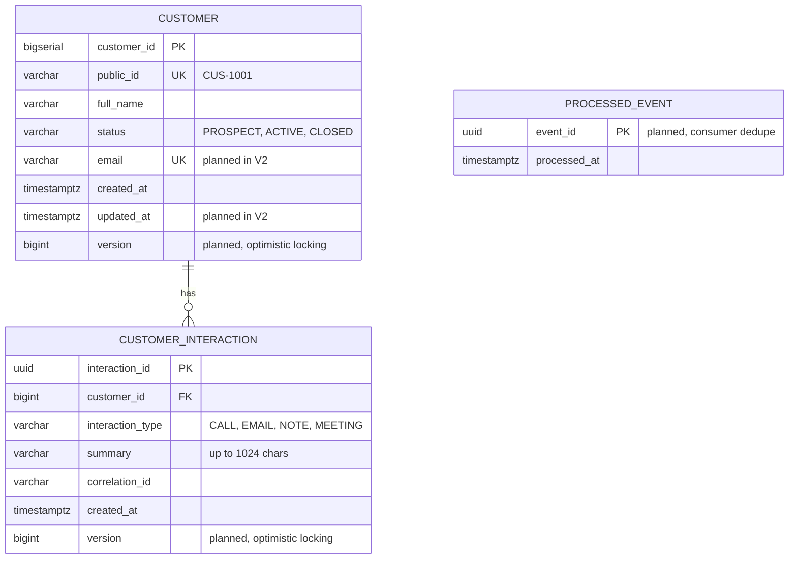
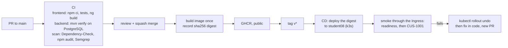

# Northstar CRM Capstone Architecture

## Scope

One vertical slice of a CRM for service agents:

- **CAP-12:** record a customer interaction
- edit interactions; ADMIN can delete an interaction
- customer search and profile
- sign-in with the roles AGENT and ADMIN
- customer create/update, lifecycle transitions and deletion without interaction history (ADMIN)

The CRUD/lifecycle additions are planned in [the contract](contract.md#crud-and-lifecycle-scope) under
[#82](https://github.com/BrandonRobare/bean-brigade-customer-management-platform/issues/82).

Fixtures only: `CUS-1001` Amina Khan (ACTIVE), `CUS-1002` Ravi Singh (PROSPECT), `CUS-9999` (does not exist),
correlation ID `lab-request-001`.

## Stack

| Layer         | Technology                                                                                           |
|---------------|------------------------------------------------------------------------------------------------------|
| UI            | Angular 19, TypeScript, signals + RxJS, `HttpClient` with functional interceptors                    |
| API           | Spring Boot 3.5 on Java 21 (Maven), REST / JSON, Bean Validation, Problem Details errors             |
| Security      | Spring Security OAuth2 resource server, self-issued RS256 JWTs, roles AGENT / ADMIN (ADR 0006)       |
| Data          | PostgreSQL 16, Spring Data JPA, Flyway migrations                                                    |
| Messaging     | Apache Kafka via `spring-kafka`, versioned events                                                    |
| Delivery      | GitHub Actions (build, test, SAST), Docker images, k3s course cluster (Deployment, Service, Ingress) |
| Observability | Spring Boot Actuator (health, metrics), SLF4J logs with the correlation ID in the MDC                |

## Non-Goals

- **Not used anywhere, including diagrams and alternatives:** Bitbucket Pipelines, Oracle, React, SOAP, laptop k3s.
- **Not in this slice:** real customer data or PII, more than one backend service (one Spring Boot app, `crm-api`,
  serves the API and runs the Kafka consumer), manual changes on the cluster (only the pipeline deploys).

## Context

Who uses the system and what it depends on.

## Containers

The deployable parts and how they talk.

| Container  | Technology        | Responsibility                                                                | Runs locally as                         |
|------------|-------------------|-------------------------------------------------------------------------------|-----------------------------------------|
| `crm-ui`   | Angular 19, nginx | agent screens, calls the API; never decides access                            | `npx ng serve` on :4200                 |
| `crm-api`  | Spring Boot 3.5   | authentication and authorization, business rules, persistence, events, health | `mvn spring-boot:run` on :8080          |
| PostgreSQL | 16                | customers, interactions, processed events                                     | `docker compose` on :5432               |
| Kafka      | broker + topics   | interaction events, dead-letter topic                                         | `docker compose` on :9092 (to be added) |

In the cluster, `crm-ui` is its own nginx image, and the Ingress sends `/api` to `crm-api` and everything else to
`crm-ui`, so the UI and API share one origin (ADR 0007, #68). PostgreSQL runs as `crm-postgres`.

## Trust Boundaries

| Boundary         | Rule                                                                                                                                                                                                                                                                                      |
|------------------|-------------------------------------------------------------------------------------------------------------------------------------------------------------------------------------------------------------------------------------------------------------------------------------------|
| Browser → API    | **The API is the security boundary, not Angular.** Anyone can call the API directly, so every `/api/**` request is authenticated (JWT) and authorized by role on the server. The Angular guard only hides screens that would fail anyway. CORS allows the UI's origin but isn't security. |
| Token signing    | Only the token endpoint uses the private signing key, which lives in a Kubernetes Secret (locally, a `.env` path to a gitignored file). Checking a token needs only the public key.                                                                                                       |
| API → PostgreSQL | The app connects as a least-privilege `crm_app` login with data access only (planned in `V2`); Flyway migrates as the schema owner. Credentials come from environment variables or a Kubernetes Secret, never from Git.                                                                   |
| API → Kafka      | Internal network only. Events carry IDs, types and the correlation ID, never the interaction's free-text summary.                                                                                                                                                                         |
| GitHub → cluster | Only the pipeline deploys. Deploy credentials are GitHub Environment secrets; the production environment accepts only `v*` tags.                                                                                                                                                          |
| Actuator         | Liveness and readiness are open for the Kubernetes probes; `metrics` is ADMIN only; nothing else (`env`, `heapdump`, `info`) is exposed (#54).                                                                                                                                            |

## Runtime Path

One request end to end: CAP-12 for `CUS-1001`.

- Every hop logs the same correlation ID (`lab-request-001` in the demo), so one search follows the request from the UI
  to the consumer.
- Failures return Problem Details: 400 validation, 401 no or bad token, 403 wrong role, 404 unknown customer, 409
  invalid state.
- Publishing **after the commit** is **open** (ADR 0005: after commit, or a transactional outbox).

## Security View

| Endpoint                                                           | AGENT    | ADMIN  |
|--------------------------------------------------------------------|----------|--------|
| `POST /api/v1/auth/login`                                          | public   | public |
| `GET /api/v1/customers?query=`, `GET /api/v1/customers/{publicId}` | yes      | yes    |
| `GET` / `POST /api/v1/interactions`                                | yes      | yes    |
| `PATCH /api/v1/interactions/{id}` (planned)                         | yes      | yes    |
| `DELETE /api/v1/interactions/{id}` (planned)                        | no (403) | yes    |
| Customer create/update/status-change/delete (planned)              | no (403) | yes    |
| `/actuator/health/liveness`, `/actuator/health/readiness`          | public   | public |
| `/actuator/metrics`                                                | no (403) | yes    |

Tokens are self-issued (**decided**, ADR 0006). `POST /api/v1/auth/login` checks one of two in-memory demo users and
returns a JWT signed with the API's private RSA key (RS256). Spring Security's resource server checks every other
`/api/**` call with the public key, and anything not in the table above is denied. The ADMIN-only endpoints also carry
`@PreAuthorize("hasRole('ADMIN')")`, so the role check sits on the endpoint as well as in the URL rules. Until the login
page lands (Tue 10/6), the starter's fixed demo token keeps working under the `dev` profile only.

## Messaging View

- **Event contract** (proposed, ADR 0003): `eventId`, `eventType`, `eventVersion`, `occurredAt`, `correlationId`,
  `actor`, `customerId`, `interactionId`, `interactionType`. The starter record has seven of these; `eventId` and
  `actor` are added.
- **Key = customer ID,** so one customer's events stay in order.
- **Versioning:** only additive changes inside V1; a breaking change is a new `V2` event.
- **Delivery is at least once,** so the consumer is idempotent: it records each `eventId` and skips repeats. Poison
  messages go to the dead-letter topic after bounded retries.

## Data View

- `V1__crm_schema.sql` (exists) creates `customer` and `customer_interaction`, with CHECK constraints on status and
  type, an index on (customer, newest first), and seeds Amina and Ravi.
- The API exposes customers only by `public_id` (`CUS-1001`), never the internal key (proposed, ADR 0002).
- Merged migrations are never edited; every change is a new `V` file.

## Delivery Path

- The pipeline is the only way changes reach the cluster; nobody edits the cluster by hand.
- The image is built once and promoted by digest, never rebuilt at deploy.
- Environments and promotion rules: `docs/environment-strategy.md`. Gates and jobs: `docs/github-actions-plan.md`.
