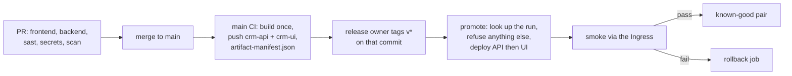

# Release plan

How a commit becomes the demo, who signs off, and what a rollback can and can't undo. The gates are in the
[release checklist](release-checklist.md); recovery is in the [rollback runbook](rollback-runbook.md).

## Flow

| Handoff | Evidence | Who |
| --- | --- | --- |
| PR → `main` | green required checks, 1 approval | author + reviewer |
| `main` → images | `image-report` artifact: both digests, commit, run URL, `builtAt` | CI |
| images → tag | the tag sits on a commit whose `main` run is green | release owner (Brandon) |
| tag → `student08` | CD summary: which run's pair was deployed | `production` environment |
| deploy → known-good | smoke output, `crm-release` ConfigMap `status=succeeded` | CD |

Nothing is rebuilt after `main`. CD reads the pair from that commit's `main` run and refuses a manifest from another
commit, a digest that isn't `sha256:`, or an image outside `ghcr.io/brandonrobare/` (`scripts/release.sh`). There is no
staging ([R-01](risk-register.md)); CI is the test stage and a local k3d cluster rehearses releases.

## Approvers

- Merge: one approval from someone other than the author (`protect-main`).
- Production: the release owner pushes the `v*` tag. The repo is public, so the `production` environment can also require
  a reviewer (R-04).
- Migrations: Bryan reviews any Flyway change before it merges. UI: Chad. Scan triage: Carter.

## Config per environment

| | Local dev | CI | Local k3d rehearsal | Production (`student08`) |
| --- | --- | --- | --- | --- |
| Profile | `dev` | `dev` | `prod` | `prod` |
| Database | `compose.yaml` | PostgreSQL 16 service | `crm-postgres` StatefulSet | `crm-postgres` StatefulSet |
| Host | `localhost:4200` | none | `crm.localhost` | `vars.PLATFORM_HOSTNAME` |
| Secrets | `change-me` defaults | `change-me` | generated, local only | `production` environment secrets |
| Images | built locally | built, pushed on `main` | local registry, by digest | GHCR, by digest |

Production names only, never values: environment secrets `KUBECONFIG`, `CRM_DB_PASSWORD`, `CRM_AGENT_PASSWORD`,
`CRM_ADMIN_PASSWORD`, `CRM_JWT_PRIVATE_KEY`, `CRM_JWT_PUBLIC_KEY`, optional `CRM_TLS_CERT` / `CRM_TLS_KEY`; environment
variables `PLATFORM_HOSTNAME`, `INGRESS_CLASS`, `STORAGE_CLASS`, `INGRESS_NAMESPACE`.

## Rollout

Rolling update, `maxSurge: 1`, `maxUnavailable: 0`: the old pod serves until the new one is ready, and a 5-second
`preStop` sleep keeps it answering while Traefik stops routing to it. CD rolls the API, waits, then the UI, because both
surging with the topic Job would exceed the CPU quota (R-13). A manifest change to both pod templates still rolls both
at once when it's applied; that fits the quota unless the topic Job is running. Blue-green needs two of
everything and canary needs traffic splitting; neither fits one namespace.

## Database compatibility

- Expand before contract. A release may add tables, nullable columns or defaults. Dropping or renaming waits for the
  next release, after nothing reads the old shape.
- The previous image must still start on the new schema. Bryan checks this on every migration PR.
- Flyway never runs backwards. Rollback swaps images only; it can't undo a migration or data written since.
- If a release contracted the schema, rolling back the image is not enough: stop, and fix forward with a new release.

Today there is one migration (`V1__crm_schema.sql`), so every release so far is compatible both ways.

## Recovery targets

- RTO: under 5 minutes from deciding to roll back to a passing smoke.
- RPO: none guaranteed. One PostgreSQL pod on one PVC with no backups (R-09); synthetic data only.

## Watch window

30 minutes after a release: pod restarts, readiness, `5xx` in the API logs, and the smoke result. Anything from the
[rollback triggers](rollback-runbook.md#triggers) means rollback first, investigate second.

## Release notes

Each `v*` tag gets a GitHub release with: the change list, the two digests from its manifest, the smoke result, known
issues, and who to contact (Brandon for release, Bryan for data, Chad for UI).

Known issues before the first release:

- `GET /api/v1/customers/{id}` isn't built yet (CAP-14), so smoke fails its two customer reads until it is.
- Angular sign-in and the Kafka producer/consumer are unfinished.
- Platform hostname, certificate and classes are still to come from the instructor (R-02).
