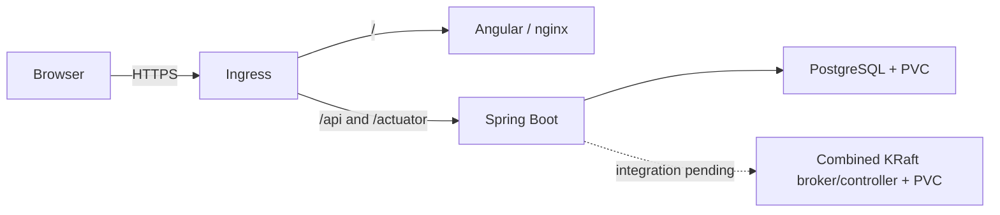

# Capstone Kubernetes deployment files

These files target the supplied **k3s `student08` namespace**, not native OpenShift. The assignment's folder name is
retained for traceability to Labs 48/51. Instructor acceptance of the platform substitution remains open.
Steps 2–4 implement local runtime/container/manifests; GitHub publication, CD and live deployment are later steps.

## What each piece does

| Kubernetes term | Here | Purpose |
| --- | --- | --- |
| Pod | One container per API, UI, database or Kafka pod | The running process and its mounts |
| Deployment | `crm-api`, `crm-ui` | Replace application pods and roll out new images |
| StatefulSet | `crm-postgres`, `crm-kafka` | Keep predictable pod names and persistent disk claims |
| Service | Internal API/UI, Postgres and Kafka names | Give callers stable addresses while pods change |
| PVC | `data-crm-postgres-0`, `data-crm-kafka-0`, 2 GiB each | Keep database and Kafka data when a pod restarts |
| ConfigMap | API, Kafka and platform settings | Hold configuration that is safe to commit |
| Secret | Referenced below; never defined with values here | Supply passwords, signing keys, registry login and TLS |
| Ingress | `crm-https`, `crm-http` | Route a public hostname to the appropriate internal Service |
| NetworkPolicy | Default deny plus explicit allowed flows | Restrict network access to the application pods |
| Job | `crm-kafka-topics` | Create the contract topic once, safely if it already exists |



The browser calls relative `/api/...`; it never calls its own `localhost:8080` in production. nginx serves the UI
and SPA deep links. HTTPS requests go directly from Ingress to the API for `/api` and `/actuator`, without path
rewrites. The HTTP Ingress routes every path to nginx's 308 redirect, relying on the trusted controller's
`X-Forwarded-Proto`. This avoids a Traefik Middleware resource the student account cannot create. Confirm the
controller's `web`/`websecure` entrypoints and header handling before any public demo. API security additionally
requires HTTPS for API/metrics and leaves status-only health available to internal HTTP probes.

## Required inputs before deployment

`configuration.yaml` deliberately contains an invalid demo hostname and unconfirmed class/namespace markers.
Replace **only the `crm-platform` data** with the approved hostname, StorageClass, IngressClass and controller
namespace in a temporary release copy before rendering. Kustomize propagates those values into both Ingresses,
TLS hosts, PVC templates and the ingress NetworkPolicy. DNS access currently assumes CoreDNS in `kube-system`;
confirm this and that the cluster's CNI enforces NetworkPolicies. These are configuration candidates, not verified
platform facts. Never change a StatefulSet's storage class after its PVCs are established without a migration.

Release API/UI images are intentionally `:release-required` markers. Steps 5–6 replace them with the verified
CI-built digest pair. Never substitute a mutable release tag or invent a digest. PostgreSQL 16.15 and Apache
Kafka 3.9.1 are pinned to multi-platform index digests resolved on 2026-10-06; both include Linux amd64. Scan and
update these deliberately; local startup alone is not a clean image scan. nginx's base digest is in its Dockerfile.

| Existing Secret needed | Keys/type | Used by |
| --- | --- | --- |
| `crm-db` | `password` | PostgreSQL initialization and API JDBC |
| `crm-auth` | `agent-password`, `admin-password` | Synthetic production login accounts |
| `crm-jwt` | `jwt-private.pem`, `jwt-public.pem` | API mount at `/var/run/secrets/jwt`, mode 0440 and fsGroup 10001 |
| `ghcr-pull` | `kubernetes.io/dockerconfigjson` | Runtime ServiceAccount's private image pulls |
| `crm-tls` | `kubernetes.io/tls` | Trusted certificate/key for the approved Ingress hostname |

No Secret value, kubeconfig, IP or real hostname belongs in this directory. CD will upsert approved values securely
in Step 6. The runtime ServiceAccount has no RBAC grants and does not mount an API token. Containers run non-root,
drop capabilities and prohibit privilege escalation. API/UI/Postgres use read-only roots plus scratch mounts.
Kafka's supported upstream entrypoint writes `/opt/kafka/config`, so its root stays writable; data goes to its PVC.
Fixed UIDs are validated for these k3s images, not for OpenShift's arbitrary-UID SCC policy.

## Quota and rollout order

| Component | Request CPU / memory | Limit CPU / memory |
| --- | --- | --- |
| API | 500m / 768 MiB | 1000m / 1536 MiB |
| UI | 100m / 128 MiB | 250m / 256 MiB |
| PostgreSQL | 250m / 256 MiB | 500m / 512 MiB |
| Kafka | 500m / 768 MiB | 1000m / 1536 MiB |
| Topic Job, temporarily | 100m / 128 MiB | 250m / 256 MiB |

Steady workloads request 1350m / 1920 MiB and limit 2750m / 3840 MiB. The worst planned API rollout, including the
topic Job, requests 1950m / 2816 MiB and limits 4000m / 5632 MiB. This fits the checked 2 CPU / 3 GiB request,
4 CPU / 6 GiB limit and 15-pod quota, but does not prove node capacity or disk availability.

**Roll out API, wait for readiness, then roll out UI.** Both Deployments allow one extra pod and keep the old pod
until the replacement is ready. Simultaneous surges with the topic Job exceed the CPU quota. A later CD job must
sequence the application changes instead of applying both updated Deployments together. Changed environment
ConfigMaps/Secrets also require an intentional restart; environment values do not refresh inside existing pods.
The API uses [status-only Actuator probes and production JWT rules](../docs/api-runtime.md).

## Kafka and persistence

Kafka uses the Module 30 combined KRaft model: one container performs both broker and controller roles. No
ZooKeeper container is needed. `CLUSTER_ID`, node ID and the voter hostname stay stable. Both Kafka metadata and
broker logs live under the same PVC; advertising `crm-kafka:9092` gives the application a stable internal address.
The headless Service publishes the pod address before readiness so quorum startup does not wait on itself.

The topic Job uses `--if-not-exists` for `crm.customer.interactions.v1`, one partition and replication factor 1,
matching [the current contract](../docs/contract.md). Auto-topic creation is disabled. Additional DLT/retry topics
must be explicitly agreed with the messaging lane before its integration ships. Synthetic event retention is
24 hours with a 128 MiB per-partition log cap; increase disk/retention for retained business data.

PVCs preserve data across pod restarts. They provide neither backup nor replication. One Postgres pod and one
combined Kafka node are single points of failure. Application releases must not delete PVCs, regenerate Kafka's
cluster ID or reverse Flyway migrations automatically. Schema compatibility and secret rotation require their
own recovery planning. Splitting Kafka roles while retaining data is a planned migration, not a manifest toggle.

## Safe checks at this stage

From the repository root:

```sh
kubectl kustomize openshift
kubectl --context student08 apply --dry-run=server --validate=strict -k openshift
```

The first command renders files locally. The second asks the Kubernetes API to validate requests but does not
save resources; it requires the authorized context. A successful dry run does **not** verify PVC binding, image
pulls, DNS, NetworkPolicy enforcement, public TLS or a live customer journey. Do not apply the placeholder bundle.
The eventual release pipeline is the deployment path; no actual deployment command is provided at this stage.

Local evidence is recorded in [the Steps 2–4 report](../reports/deployment-foundation-2026-10-06.md).
The full Actions/CD runbook and defense evidence are completed in Steps 5–7. Genuine Angular login/API calls,
customer screens and Kafka producer/consumer integration remain application-lane prerequisites for live smoke.
